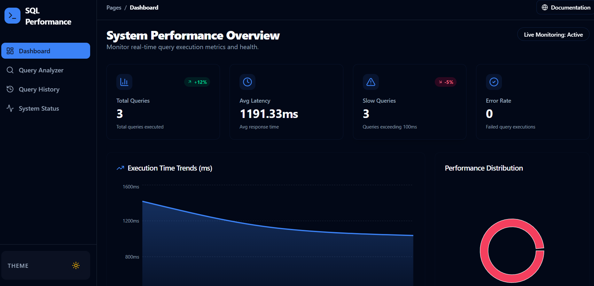
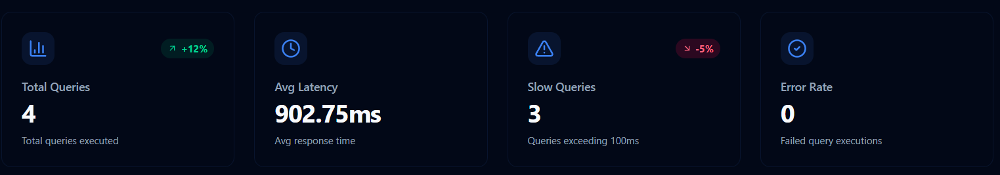
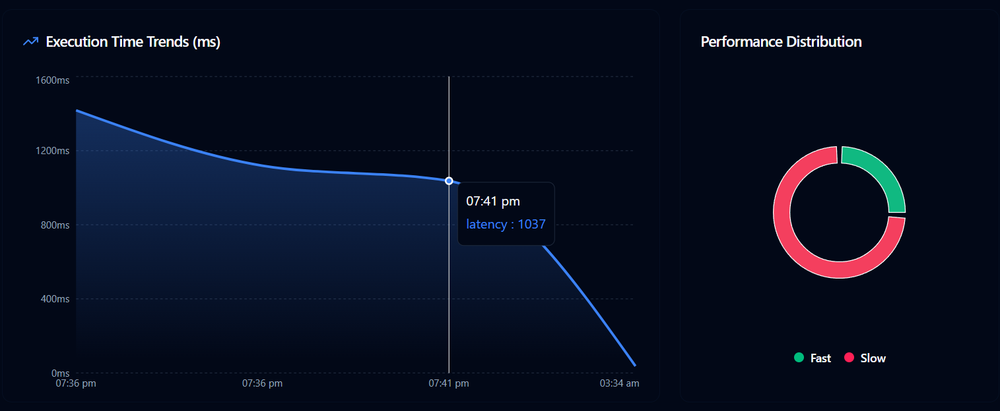
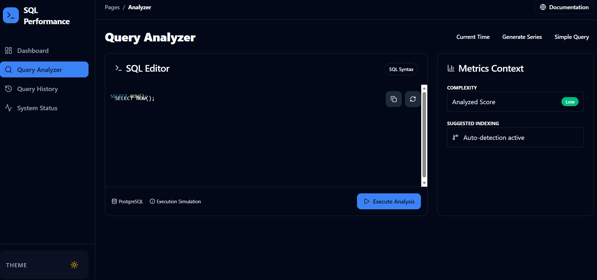
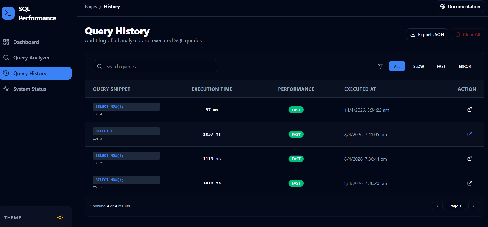
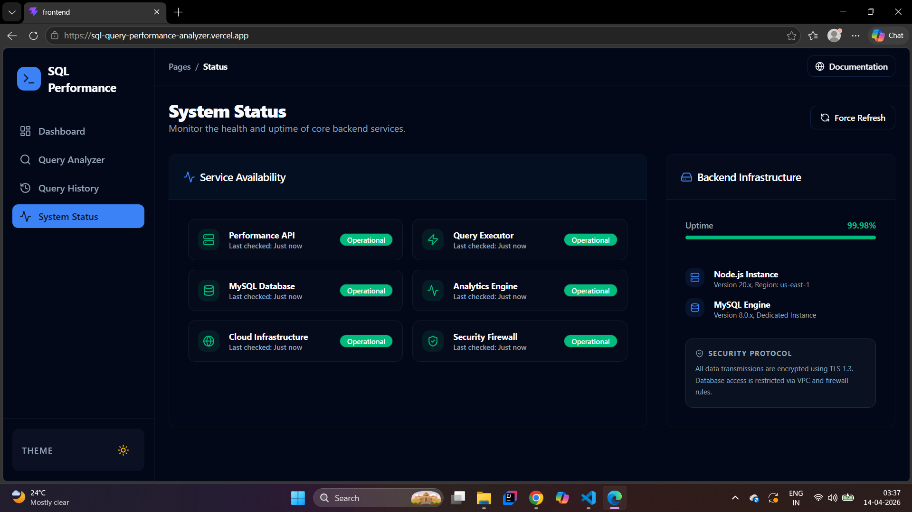
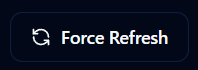

# SQL-query-performance-analyzer

Real-Time Database Query Monitoring & Performance Analysis

This project is a SQL query performance monitoring dashboard designed to analyze database activity and identify performance bottlenecks.

It helps developers and database administrators monitor query execution, system status, query counts, and historical performance metrics through an interactive dashboard.

The system simulates how modern database observability tools track and visualize query performance in real time

## Project Overview

Database performance plays a critical role in backend systems.
Slow queries, inefficient indexes, and high database load can severely affect application performance.

This project provides a visual monitoring dashboard that helps analyze:
Query execution statistics
Query performance trends
System health
Query history
Database workload distribution

The dashboard helps identify slow queries and potential performance issues.

## System Architecture

Typical workflow of the SQL monitoring system:

Database Queries
      ↓
Query Logger / Analyzer
      ↓
Database Metrics Collection
      ↓
Backend Processing
      ↓
Performance Dashboard

The system continuously collects database metrics and visualizes them in a dashboard.

## Technologies Used

### Backend

Node.js
Express.js
REST API

### Database

SQL
PostgreSQL / MySQL
Query performance analysis

### Monitoring
Query performance tracking
Database metrics collection
System health monitoring

### Visualization
Charts
Dashboard analytics
Query history analysis

### Features
Query performance analysis
Query history tracking
Real-time system status monitoring
Database workload visualization
Query count tracking
Interactive performance charts
Dashboard analytics

### Project Structure

Example repository structure:

SQL-Performance-Analyzer
│
├── images
│   ├── dashboard.png
│   ├── charts.png
│   ├── counts.png
│   ├── query-analyzer.png
│   ├── query-history.png
│   ├── system-status.png
│   ├── force-refresh.png
│   ├── themebutton.png
│   └── themebutton2.png
│
├── backend
│
├── database
│
└── README.md

## Screenshots

### dashboard

### counts

### Charts

### query analyzer

### query History

### System Status

### Theme Button

### Force Refresh

## Real-World Use Cases

This system architecture is commonly used in:

Database observability tools
Performance monitoring platforms
Backend debugging systems
Query optimization tools
Production database monitoring

## Learning Outcomes

Through this project I learned:

SQL query performance analysis
Database monitoring concepts
Backend API development
Query analytics visualization
Debugging database performance issues

## Future Improvements

Add automated slow query detection
Integrate Grafana dashboards
Add alerting system for slow queries
Implement query optimization suggestions
Add distributed database monitoring

## Author

Srushti Mokshi

MCA Student
Interested in Backend Systems, Observability, API Monitoring, and Distributed Systems

## Live Demo

Frontend:
https://sql-query-performance-analyzer.vercel.app

Backend API:
https://sql-query-performance-analyzer-project.onrender.com

Health Check:
https://sql-query-performance-analyzer-project.onrender.com/api/health
